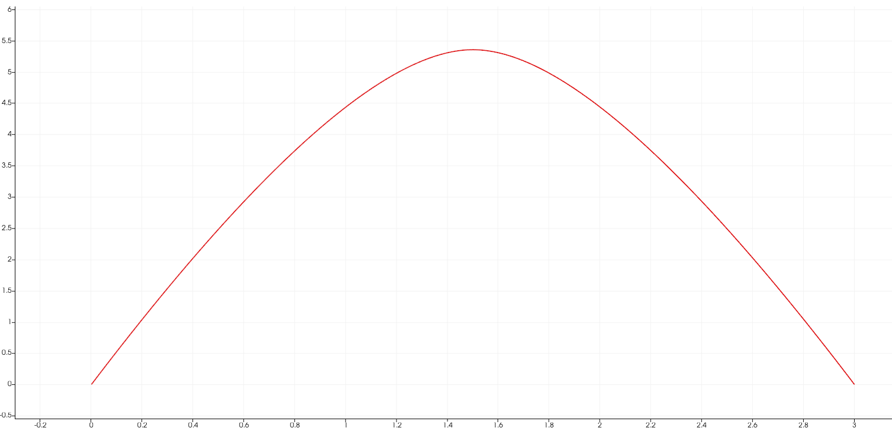
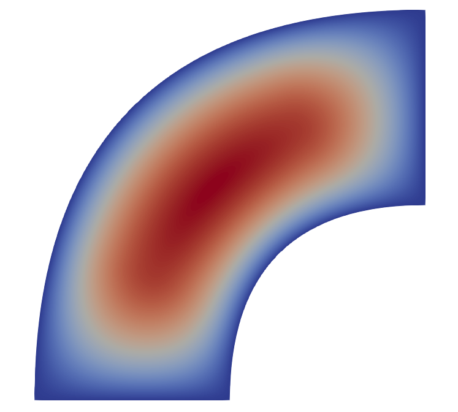
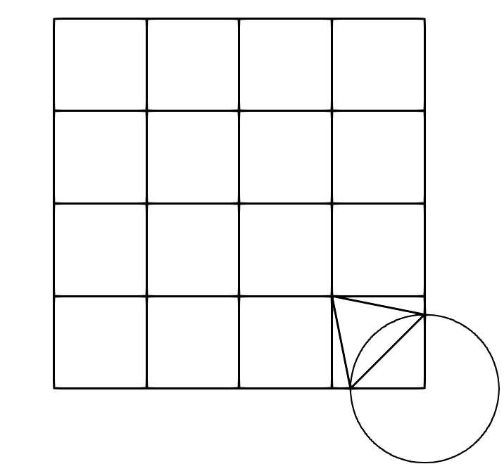

# IGA-implementation-in-CPP
An object oriented approach for solving elliptic (1D and 2D) and parabolic (1D) PDEs using Isogeometric Analysis with Nurbs.

Example Poisson 1D (Dirichlet boundary conditions)

Example Poisson 2D (Dirichlet boundary conditions)

Example Diffusion 1D (Dirichlet boundary conditions)

Example Poisson 2D on Trimmed domain (mixed boundary conditions)

Assemblers Inheritance Diagram

Bspline Inheritance Diagram

